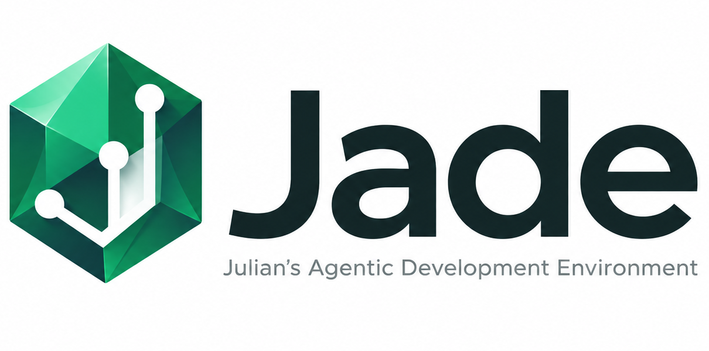

# Jade — Julian's Agentic Development Environment



**Status:** 0.0.1 — early, usable, and looking for feedback.

Jade is an MCP server that gives a coding agent structural access to a
codebase: read and edit by *symbol* rather than by line number, validate the
result, and track what changed — without shelling out.

The bet is narrow and testable. An agent that falls back to `grep`/`sed`/`cat`
is operating outside any tooling you control: no revision tracking, no
guardrails, no telemetry. So jade tries to be the cheaper option for the things
agents actually do, and measures whether it succeeded. On this repo's own
benchmark, jade answers seven realistic questions in **0.85x** the tokens of
the equivalent shell commands (it was 5.63x before the plain-text renderer —
see [docs/response-style.md](docs/response-style.md)).

```bash
make binary
./bin/jade-mcp --version
```

Then point your MCP client at `bin/jade-mcp` — see [Install](#install) for the
JSON stanza. Jade works on any directory; it does not have to be its own
checkout.

## What Jade gives an agent

**Read** — `outline` (file structure), `read_symbol` (one declaration by name
or ID), `read_range` (verbatim lines, or a whole file), `find` (locate a
declaration *and* get its body in one call), `grep` (literal or regex text
search with path filters), `search` (rank declarations by name similarity),
`references` (find usages, gopls-backed for Go), `repository_map` (rank files
against a task within a token budget), `retrieve`, `context`,
`workspace_tree`, `search_nudge`.

**Edit** — `replace_text` (anchored on exact unique text, not line numbers),
`replace_symbol`, `replace_range`, `delete_symbol`, `create_file`,
`replace_file`, `delete_file`, `rename` (gopls-backed, cross-file), and
`apply` — several edits as one atomic unit: anchors validated up front, all
applied or none, one revision bump and one validation at the end. `apply` also
carries an `insert` op (append, or place text before/after an anchor), which
has no standalone tool of its own.

**Validate** — `check` (build/typecheck/tests, discovering the repo's own
Makefile target, npm script or cargo command), `run_tests` (scoped to a file,
a test name, or changed files), `run_command` + `declare_command` (a
version-controlled registry of project commands — lint, codegen, migrate — run
by name), `job_status`, `job_output`.

**State** — `changes` (what moved, by file and by symbol), `diff` (the patch,
including untracked files; `since` for any git revision), `history` (which
commits touched one symbol, via `git log -L`), `checkpoint` / `revert`,
`events`, `telemetry`.

Every response is plain text, shaped to lead with the decisive line.

## What Jade does not do yet

This list is more useful than the one above — it tells you what is worth
reporting and what is already known.

- **Only Go, TypeScript, TSX and Rust get a real grammar.** Everything else
  falls back to a text scan that finds some declarations and misses others.
  Jade says so in the response (`! no python grammar — …`) rather than
  pretending the outline is complete, but it is still a fallback.
- **`references` and `rename` are Go-only in their precise form.** They use
  `gopls`; without it, or in another language, `references` degrades to a
  textual approximation and `rename` refuses rather than guessing.
- **No LSP client.** Jade shells out to `gopls` subcommands. Cross-language
  semantic analysis is not there.
- **No `blame`, no cross-repo work, no remote execution.**
- **Formatting covers gofmt and rustfmt only.** TypeScript, JSON and Markdown
  are deliberately left alone, since their formatters take project config and
  could reformat far more than the agent touched.
- **Revision tracking is jade's own counter, not git's.** It detects
  concurrent edits within a session; it is not a VCS.
- **Telemetry is local only.** It writes `.jade/telemetry.jsonl` in your
  workspace and is never transmitted. `JADE_TELEMETRY=0` disables it.
- **Not hardened for untrusted input.** It runs shell commands you declare and
  edits files you point it at. Treat it as a development tool.

Bug reports and "this made me reach for bash instead" reports are both
valuable — the second kind especially.

**Reporting:** [docs/reporting.md](docs/reporting.md) says what makes a useful
report, and there are three issue templates — **bug**, **friction** ("I used
the shell instead") and **feature**. If you are unsure which, pick friction;
it is the cheapest to write and the easiest to act on. "It was just habit" is
a real answer and we want it.

[feedback.md](feedback.md) is the same log kept from the inside during jade's
own development — sixteen tasks of recording every shell fallback and why.

## Stability

Tool names and required arguments are frozen for 0.0.1 and enforced by a test
— see [docs/tool-contract.md](docs/tool-contract.md) for the full surface and
the policy on what counts as a breaking change.

Two things worth knowing up front: the MCP catalog is fixed at connection time,
so a newly added tool does not appear until the client reconnects; and response
*wording* is not frozen — treat responses as text for a model to read, not as a
format to parse. `JADE_JSON=1` gives machine-readable output instead.

## Install

Build the MCP server binary:

```bash
make binary          # produces bin/jade-mcp, version stamped from git describe
./bin/jade-mcp --version
```

Or install it onto your `PATH`:

```bash
make install         # go install, into $GOBIN or $GOPATH/bin
```

### MCP client configuration

Point your MCP client at the built binary:

```json
{
  "mcpServers": {
    "jade": {
      "type": "stdio",
      "command": "/absolute/path/to/jade/bin/jade-mcp",
      "env": {
        "JADE_WORKSPACE_ROOT": "/absolute/path/to/the/repo/you/want/jade/to/work/on"
      }
    }
  }
}
```

`JADE_WORKSPACE_ROOT` is the repository jade inspects and edits. It does not
have to be the jade checkout — that is the whole point of pointing it
somewhere else. A `--root /path/to/repo` flag takes precedence over it, and
jade prints which of the two (or the working directory) it used at startup, so
an agent can never quietly operate on the wrong repository.

Jade works on a non-git directory and on a repository with no commits yet. In
both cases it says what is degraded — `changes`, `diff`, `history` and
`checkpoint` need git — and everything else keeps working.

**Use the binary, not `go run ./cmd/jade-mcp`.** A `go run` stanza recompiles
at every process start: measured here at 284–584ms to first handshake against
14ms for the binary, and that is with a warm build cache. A cold one is
seconds. It also means the server silently changes whenever the source does,
which is useful while developing jade itself and confusing everywhere else.

If you are hacking on jade, the reverse applies — a `go run` stanza picks up
your changes on reconnect, where the binary needs `make binary` first. This
repo's own `.mcp.json` deliberately still uses `go run` for that reason.

## Internals and design notes

### Scaffold status

The repository now includes an initial Go scaffold aligned with the architecture in [scope.md](scope.md):

- [cmd/jade/main.go](cmd/jade/main.go): runtime entrypoint and service wiring
- [internal/workspace](internal/workspace): workspace state and revision manager
- [internal/code](internal/code): structural code index placeholder
- [internal/edit](internal/edit): mutation service placeholders
- [internal/diagnostics](internal/diagnostics): immediate diagnostics abstraction
- [internal/jobs](internal/jobs): asynchronous job runner abstraction
- [internal/languages](internal/languages): language adapter registry and stubs
- [internal/transport/mcp](internal/transport/mcp) and [internal/transport/internalapi](internal/transport/internalapi): transport facades
- [internal/protocol/types.go](internal/protocol/types.go): shared protocol types
- [configs/jade.example.yaml](configs/jade.example.yaml): starter runtime config

### Current runtime slice

The scaffold now includes the first source-grounded runtime behavior inspired by proven droneship patterns:

- Workspace revision and freshness checks against git HEAD and dirty paths in [internal/workspace/manager.go](internal/workspace/manager.go)
- Non-blocking in-process event bus in [internal/events/bus.go](internal/events/bus.go)
- Progressive disclosure primitives for code outlines and symbol reads in [internal/code/index.go](internal/code/index.go)
- Structured outline sections for imports/types/classes/functions/methods in [internal/code/index.go](internal/code/index.go)
- Repository map + token-budget ranking for relevant files in [internal/code/index.go](internal/code/index.go)
- Go tree-sitter symbol extraction with regex fallback switch in [internal/code/index.go](internal/code/index.go) and [internal/code/treesitter_go.go](internal/code/treesitter_go.go)
- Edit responses with immediate diagnostics and async job IDs in [internal/edit/service.go](internal/edit/service.go)
- Job lifecycle status and events in [internal/jobs/runner.go](internal/jobs/runner.go)
- Decisive validation summaries with explicit raw-output expansion in [internal/jobs/runner.go](internal/jobs/runner.go)
- Internal API and MCP transport parity for inspect/modify/state/job/event operations in [internal/transport/internalapi/server.go](internal/transport/internalapi/server.go) and [internal/transport/mcp/server.go](internal/transport/mcp/server.go)
- Checkpoint/revert state primitives with event emission in [internal/workspace/manager.go](internal/workspace/manager.go)

### Repository map behavior

JADE now exposes a repo-level relevance ranking tool so an agent can ask:

```text
query: "session refresh bug"
maxTokens: 4096
```

and receive a prioritized shortlist of likely files, plus the omitted remainder. The score is based on the task terms matching the file path, basename, and content, with a bias toward implementation code under `internal/` and a down-weight for documentation-heavy files.

Because the tool is exposed through the local MCP server, the same call pattern works in the Copilot session via `jade.repository_map`.

### Reference notes

- Source-grounded droneship extraction and decisions: [docs/droneship-findings.md](docs/droneship-findings.md)
- Follow-up implementation queue: [docs/mvp-next-steps.md](docs/mvp-next-steps.md)
- MVP scope and dogfooding TODOs: [docs/mvp-scope-todos.md](docs/mvp-scope-todos.md)
- Dogfooding feature tasks: [docs/dogfooding-feature-tasks.md](docs/dogfooding-feature-tasks.md)
- Dogfooding run log template: [docs/dogfooding-run-log.md](docs/dogfooding-run-log.md)
- Dogfooding comparison report template: [docs/dogfooding-report.md](docs/dogfooding-report.md)
- Go tree-sitter spike notes: [docs/tree-sitter-spike-notes.md](docs/tree-sitter-spike-notes.md)

Quick commands:

```sh
make fmt
make test
make build

# show file-level declarations
go run ./cmd/jade outline README.md

# show structured outline section counts
go run ./cmd/jade api-outline-sections docs/fixtures/outline_sections.ts

# demonstrate checkpoint -> mutate -> revert flow
go run ./cmd/jade api-checkpoint-demo

# demonstrate decisive summary + raw output expansion
go run ./cmd/jade api-job-summary-demo

# compare Go parser modes (regex vs tree-sitter)
go run ./cmd/jade api-go-parser-compare docs/fixtures/go_treesitter_spike.go
```

## Use JADE In Copilot Session (MCP)

This repo now includes a local MCP stdio server entrypoint:

- [cmd/jade-mcp/main.go](cmd/jade-mcp/main.go)

Workspace MCP config is included in:

- [.vscode/mcp.json](.vscode/mcp.json)

To attach it to a GitHub Copilot chat session in VS Code:

1. Reload window after pulling latest changes.
2. Open a new Copilot chat session in this workspace.
3. Confirm the `jade` MCP server is enabled in MCP server settings.
4. Call JADE tools from chat (for example `jade.outline` and `jade.read_symbol`).

The server uses this env var for workspace root:

- `JADE_WORKSPACE_ROOT=${workspaceFolder}`

---

## 1. Executive summary

Jade is an Agent Development Environment designed specifically for software-engineering agents.

The objective is to expose the information advantage of a modern IDE through an agent-native interface optimized for tokens, model turns, latency, and correctness.

Jade sits between the agent and the development workspace:

```text
Agent / Agent Harness
        │
        ▼
       Jade
        │
 ┌──────┼────────┬─────────┐
 ▼      ▼        ▼         ▼
Code   Edit   Diagnostics  Tests
Model  Engine     / LSP    / Build
 │
 ▼
Repository
```

---

## 2. Problem

Current coding agents spend too much context and too many turns on deterministic workflows that modern IDEs already solve.

Main inefficiencies:

- Context inefficiency
- Round-trip inefficiency
- Semantic weakness
- Tool-output inefficiency

---

## 3. Product definition

Jade owns the agent's interaction with a software workspace and provides:

- **Inspect**: Efficient code understanding
- **Modify**: Precise code changes
- **Validate**: Immediate correctness feedback
- **State**: Coherent workspace change tracking

---

## 4. What Jade is not

Jade is **not**:

- an LLM
- an agent reasoning loop
- a CI system
- a source-control hosting system
- a graphical IDE
- a shell replacement

Jade is specifically the development environment runtime for agents.

---

## 5. North Star

> Jade is a stateful, language-aware development runtime that allows autonomous software-engineering agents to inspect, modify, and validate arbitrarily large codebases while consuming only the context necessary for the current task.

---

## 6. North Star design principles

### 6.1 Progressive disclosure

Return the minimum sufficient representation first (outline before full source, summary before raw logs).

---

## 7. Structural addressing

Lines remain useful, but symbols are first-class objects.

Example target:

```text
src/auth/session.ts::SessionManager.refreshSession
```

Core operations:

```text
read(symbol)
replace(symbol, new_code)
references(symbol)
callers(symbol)
history(symbol)
```

---

## 8. In-place replacement

Core edit primitive:

```text
replace function SessionManager.refreshSession with <new implementation>
```

Also support range replacement with unrestricted replacement length.

---

## 9. Revision safety

Mutable edits must include expected revision and reject stale edits.

---

## 10. Diagnostics-on-edit

Every edit returns consequences, not just “success”, including parse/lint/type diagnostics plus background validation scheduling.

---

## 11. Asynchronous validation

Separate:

- **Immediate** feedback: parse/syntax/incremental diagnostics/fast lint
- **Asynchronous** jobs: full typecheck/build/tests

Provide event stream or polling fallback.

---

## 12. Structured test output

Return concise structured results first (status, failed tests, relevant stack), with raw output expandable on demand.

---

## 13. Changed-set awareness

Treat change sets as first-class objects with semantic summaries before textual diffs.

---

## 14. North Star inspection capabilities

- Structural inspection
- Search (text/regex/symbol/semantic/structural)
- Code intelligence (definitions/references/callers/callees/types)
- Context intelligence for change-oriented task scope

---

## 15. North Star modification capabilities

Long-term: symbol/range edits, inserts, create/delete/move files, rename, code actions, signature/refactor flows.

---

## 16. North Star validation capabilities

Parser + LSP + lint + typecheck/build/tests/integration/static/security.

Rule: conclusions first, raw output expandable.

---

## 17. North Star runtime/debugging capabilities

Debugger-style structured runtime insight is in North Star, not MVP.

---

## 18. North Star history capabilities

Semantic history and blame at symbol level are North Star capabilities.

---

## 19. Architecture

```text
                           Agent Harness
                                │
                                │ Jade Protocol
                                ▼
┌──────────────────────────────────────────────────────────┐
│                         JADE                             │
│                                                          │
│  ┌─────────────────┐      ┌───────────────────────────┐ │
│  │ Workspace       │      │ Code Intelligence        │ │
│  │ Manager         │      │                           │ │
│  │ revisions       │      │ parser / symbols         │ │
│  │ worktrees       │      │ LSP                      │ │
│  │ checkpoints     │      │ search                   │ │
│  └────────┬────────┘      └────────────┬──────────────┘ │
│           │                            │                 │
│           │       ┌────────────────────┘                 │
│           ▼       ▼                                      │
│      ┌─────────────────┐                                 │
│      │ Edit Engine     │                                 │
│      └────────┬────────┘                                 │
│               │                                          │
│               ▼                                          │
│      ┌─────────────────────┐                             │
│      │ Validation Manager  │                             │
│      └────────┬────────────┘                             │
│               │                                          │
│               ▼                                          │
│          Event Stream                                    │
└───────────────────┬──────────────────────────────────────┘
                    │
                    ▼
              Git Workspace
```

---

## 20. Architectural components

- Workspace Manager
- Parser / structural index (Tree-sitter)
- Language Intelligence Adapter

Language-neutral protocol, language-specific adapters.

---

## 21. Language support strategy

### Phase 1 languages

1. TypeScript
2. Go
3. Rust

Later: Java, Python, JavaScript, C#, Ruby, Scala, others.

---

## 22. Jade protocol

### Inspect

```text
workspace()
outline(target)
read(target)
search(query, mode)
references(symbol)
relations(symbol, relation_type)
```

### Modify

```text
replace(target, content)
insert(target, position, content)
delete(target)
rename(symbol, new_name)
```

### Validate

```text
diagnostics(scope)
test(scope)
build(scope)
events(cursor)
```

### State

```text
changes()
diff(target?)
checkpoint()
revert(target?)
```

---

## 23. Target model

Generic targetable objects:

- File
- Symbol
- Revision-scoped range
- Change set

---

## 24. Transport

Internal API is transport-independent. MCP is an adapter, not the architecture.

---

## 25. Shell strategy

Use Jade primitives when available; fallback to shell when needed.

---

## 26. MVP objective

Determine whether agents using Jade complete real engineering tasks more efficiently and reliably than shell/file-based workflows.

---

## 27. MVP scope

Exactly TypeScript, Go, Rust.

---

## 28. MVP — inspection

Implement:

```text
workspace_tree()
outline(file)
read_symbol(symbol)
read_range(file, start_line, end_line)
search_text(query)
search_symbol(query)
```

---

## 29. MVP — editing

Implement:

```text
replace_symbol(symbol, new_code)
replace_range(file, revision, start_line, end_line, new_code)
create_file(path, content)
delete_file(path)
```

---

## 30. MVP — edit response

Every edit returns structured revision transition + changed symbols + diagnostics + background jobs.

---

## 31. MVP — immediate diagnostics

Each edit triggers parse, syntax, language diagnostics, and fast lint feedback within a latency budget.

---

## 32. MVP — asynchronous validation

Provide job runner and event mechanism for typecheck/check/tests/build.

---

## 33. MVP — tests

Initial test scopes:

```text
run_test(test)
run_tests_for_file(file)
run_changed_tests()
run_project_tests(project)
```

---

## 34. MVP — structured execution output

Summarize test/build outcomes first; allow raw logs on explicit request.

---

## 35. MVP — workspace state

Implement:

```text
changes()
diff(target?)
checkpoint()
revert(target?)
```

Prefer semantic change summaries first.

---

## 36. MVP architecture

Compact architecture around workspace manager, structural index, and validation manager.

---

## 37. Suggested internal modules

```text
jade/
├── workspace/
├── code/
├── edit/
├── diagnostics/
├── jobs/
├── languages/
└── transport/
```

---

## 38. Core implementation language

Default recommendation: **Go** for Jade runtime.

---

## 39. MVP technology choices

Jade should heavily reuse deterministic tooling:

- **Structure:** Tree-sitter
- **Text search:** ripgrep
- **Source control:** Git / Git worktrees

Language tooling:

- **TypeScript:** TypeScript tooling, configured linter, configured test runner
- **Go:** gopls, Go tooling, go test
- **Rust:** rust-analyzer, cargo check, clippy where appropriate, cargo test

Jade orchestrates and normalizes these systems; it does not reimplement them.

---

## 40. North Star capabilities explicitly excluded from MVP

Do not initially build:

- vector embeddings
- semantic search
- complete call graphs
- full dependency graphs
- debugger integration
- semantic Git history
- coverage-driven affected-test inference
- AI-generated repository summaries
- automatic complex refactoring
- cross-repository indexing
- multi-agent concurrent workspace editing
- remote execution
- distributed build caches
- elaborate graphical UI
- broad language support
- custom compiler/language-server implementations

These are valid North Star items, but not MVP scope.

---

## 41. MVP execution flow

Target loop:

1. Agent receives task
2. Search symbol
3. Outline file
4. Read specific symbol
5. Inspect references (where reliable)
6. Replace symbol
7. Receive immediate diagnostics + job IDs
8. Fix diagnostics
9. Receive async test event
10. Expand only failed-test details

This sequence is Jade’s value proposition.

---

## 42. Product metrics

Primary metrics:

- Tokens per successful engineering task
- LLM/tool round trips per successful task

---

## 43. Secondary metrics

Track:

- Task success rate ↑
- Input tokens/task ↓↓
- Tool calls/task ↓↓
- LLM turns/task ↓↓
- Cost/successful task ↓↓
- Wall-clock time/task ↓
- Invalid edits ↓↓
- Repeated/full-file reads ↓↓
- Redundant test execution ↓
- Regressions introduced ↓

Constraint: token reduction is not useful if success rate drops.

---

## 44. Benchmark strategy

Run A/B benchmark using the same model/harness/repo/task/start commit:

- **Control:** shell + filesystem tooling
- **Jade:** same agent + Jade

Collect completion, tokens, turns, tool calls, wall time, cost, tests, and final diff quality.

---

## 45. Implementation phases

### Phase 0 — benchmark foundation
Baseline with existing shell/file tooling.

### Phase 1 — structural workspace
Workspace manager, worktree isolation, Tree-sitter, outlines, symbol/range read, ripgrep search.

### Phase 2 — mutation
Revisions, replace symbol/range, create/delete, changed symbols, compact diff, changes/checkpoint/revert.

### Phase 3 — diagnostics-on-edit
Integrate TS/gopls/rust-analyzer + parser/language/lint diagnostics.

### Phase 4 — asynchronous validation
Job runner, events, typecheck/check, tests, structured summaries, raw-log expansion.

### Phase 5 — evaluate MVP
Confirm tokens/turns/time decrease without reducing task success.

---

## 46. Major engineering risks

- Language abstraction leakage
- Symbol identity across edits
- LSP reliability and lifecycle handling
- Large monorepo startup/perf
- Generated code boundaries
- Arbitrary execution risks in test/build scripts

---

## 47. Product principles

1. **Structure before source.**
2. **Deterministic tools before LLM reasoning.**
3. **Every edit returns consequences.**
4. **Conclusions before logs.**
5. **Semantic operations before textual operations.**
6. **Textual escape hatches remain available.**
7. **State must be explicit.**
8. **Long-running work is asynchronous.**
9. **Jade remains model- and harness-independent.**
10. **Measure agent outcomes, not infrastructure sophistication.**

---

## 48. MVP definition of done

MVP is complete when an external agent can reliably:

1. Create isolated workspace
2. Inspect repository structure
3. Inspect file without full-file read
4. Expand selected symbol
5. Search files and symbols
6. Replace full symbol
7. Replace arbitrary range
8. Receive parser/language/linter feedback in edit response
9. Observe semantic change set
10. Start tests without blocking
11. Receive structured async test results
12. Inspect raw output only when needed
13. Checkpoint or revert

And benchmark evidence shows measurable context/turn reduction without degraded success.

---

## 49. One-sentence internal pitch

> Jade gives coding agents the equivalent of structural navigation, precise editing, and continuous feedback that modern IDEs give human developers—redesigned for LLM context, latency, and autonomous execution instead of GUI interaction.

Technical variant:

> Jade is the language-aware workspace runtime between an agent and its repository, providing progressive code disclosure, precise mutation, and automatic validation while minimizing tokens and round trips.
